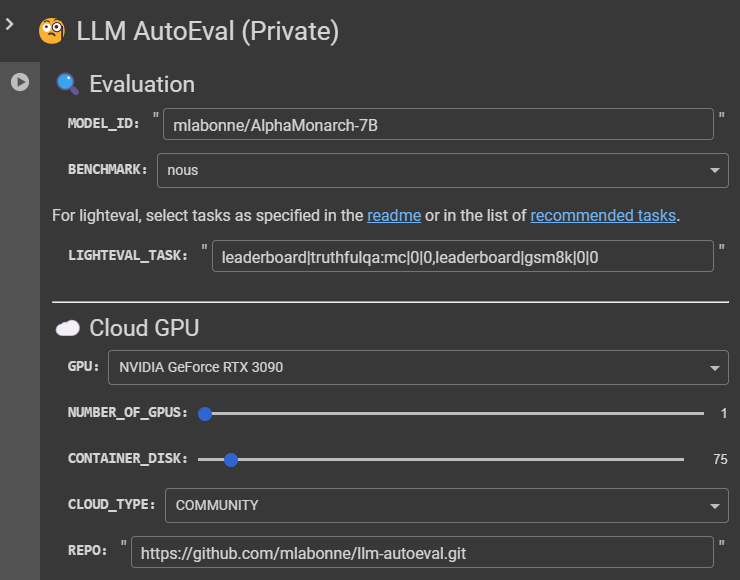

# 🧐 LLM AutoEval

## Overview

LLM AutoEval **simplifies the process of evaluating LLMs** using a convenient [Colab notebook](https://colab.research.google.com/drive/1Igs3WZuXAIv9X0vwqiE90QlEPys8e8Oa?usp=sharing). This tool is ideal for developers who aim to assess the performance of LLMs quickly and efficiently.

### Key Features

* Automated setup and execution using [RunPod](https://runpod.io?ref=9nvk2srl).
* Customizable evaluation parameters for tailored benchmarking.
* Summary generation and upload to [GitHub Gist](https://gist.github.com/) for easy sharing and reference.

[View a sample summary here.](https://gist.github.com/mlabonne/88b21dd9698ffed75d6163ebdc2f6cc8)

*Note: This project is in the early stages and primarily designed for personal use. Use it carefully and feel free to contribute.*

## Quick Start

### Evaluation parameters

* **Benchmark suite**: 
    * `nous`: List of tasks: AGIEval, GPT4ALL, TruthfulQA, and Bigbench (popularized by [Teknium](https://github.com/teknium1) and [NousResearch](https://github.com/NousResearch)). This is recommended.
    * `openllm`: List of tasks: ARC, HellaSwag, MMLU, Winogrande, GSM8K, and TruthfulQA (like the [Open LLM Leaderboard](https://huggingface.co/spaces/HuggingFaceH4/open_llm_leaderboard)). It uses the [vllm](https://docs.vllm.ai/) implementation to enhance speed (note that the results will not be identical to those obtained without using vllm). "mmlu" is currently missing because of a problem with vllm.
* **Model**: Enter the model id from Hugging Face.
* **GPU**: Select the GPU you want for evaluation (see prices [here](https://www.runpod.io/console/gpu-cloud)). I recommend using beefy GPUs (RTX 3090 or higher), especially for the Open LLM benchmark suite.
* **Number of GPUs**: Self-explanatory (not tested).
* **Container disk**: Size of the disk in GB.
* **Debug**: The pod will not be destroyed at the end of the run (not recommended).

### Tokens

Tokens use Colab's Secrets tab. Create two secrets called "runpod" and "github" and add the corresponding tokens you can find as follows:

* **Runpod**: Please consider using my [referral link](https://runpod.io?ref=9nvk2srl) if you don't have an account yet. You can create your token [here](https://www.runpod.io/console/user/settings) under "API keys" (read & write permission). You'll also need to transfer some money there to start a pod.
* **GitHub**: You can create your token [here](https://github.com/settings/tokens) (read & write, can be restricted to "gist" only).

## Benchmark suites

### Nous

You can compare your results with:
* Models like [OpenHermes-2.5-Mistral-7B](https://huggingface.co/teknium/OpenHermes-2.5-Mistral-7B#benchmark-results), [Nous-Hermes-2-SOLAR-10.7B](https://huggingface.co/NousResearch/Nous-Hermes-2-SOLAR-10.7B), or [Nous-Hermes-2-Yi-34B](https://huggingface.co/NousResearch/Nous-Hermes-2-Yi-34B). 
* Teknium stores his evaluations in his [LLM-Benchmark-Logs](https://github.com/teknium1/LLM-Benchmark-Logs).

### Open LLM

You can compare your results with those listed on the [Open LLM Leaderboard](https://huggingface.co/spaces/HuggingFaceH4/open_llm_leaderboard).

## Troubleshooting

* **"Error: File does not exist"**: This task didn't produce the JSON file that is parsed for the summary. Activate debug mode and rerun the evaluation to inspect the issue in the logs.
* **"700 Killed" Error**: The hardware is not powerful enough for the evaluation. This happens when you try to run the Open LLM benchmark suite on an RTX 3070 for example.
* **Outdated CUDA Drivers**: That's unlucky. You'll need to start a new pod in this case.

## Acknowledgements

Special thanks to EleutherAI for the [lm-evaluation-harness](https://github.com/EleutherAI/lm-evaluation-harness), [dmahan93](https://github.com/dmahan93) for his fork that adds agieval to the lm-evaluation-harness, [NousResearch](https://github.com/NousResearch) and [Teknium](https://github.com/teknium1) for the Nous benchmark suite, and 
[vllm](https://docs.vllm.ai/) for the additional inference speed. 
